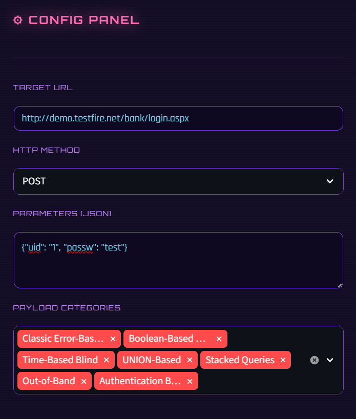
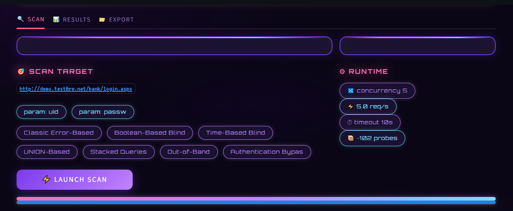
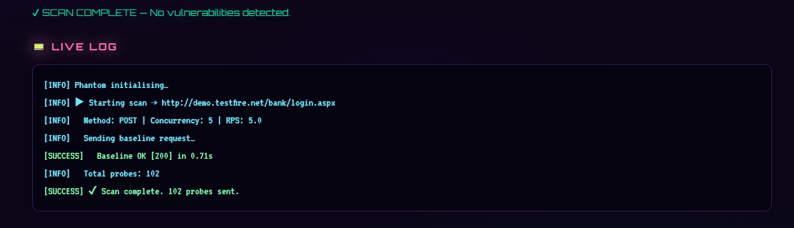
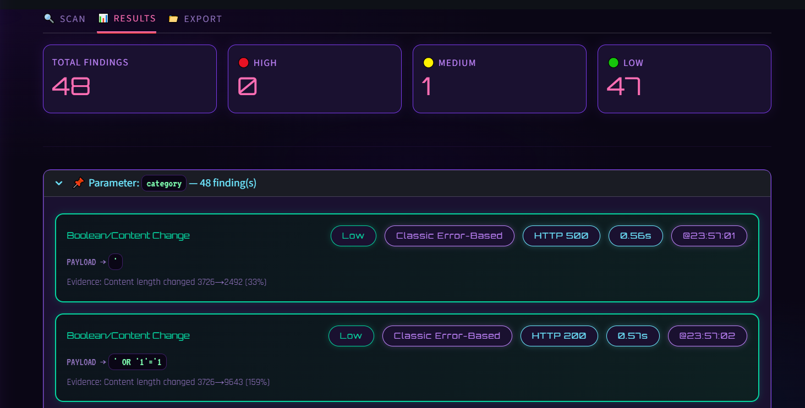
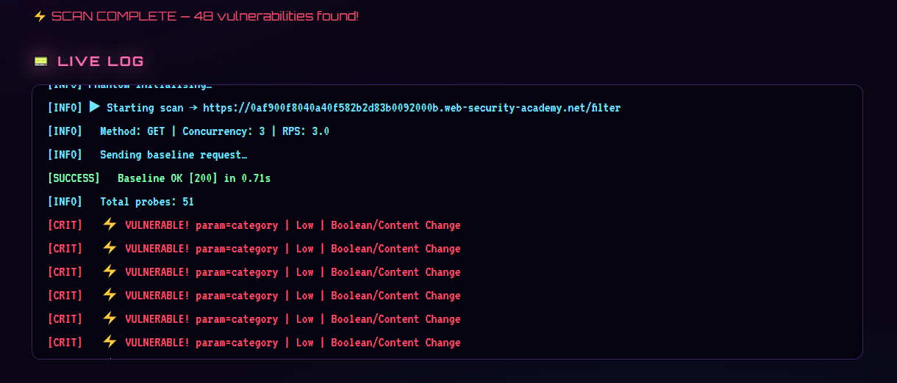
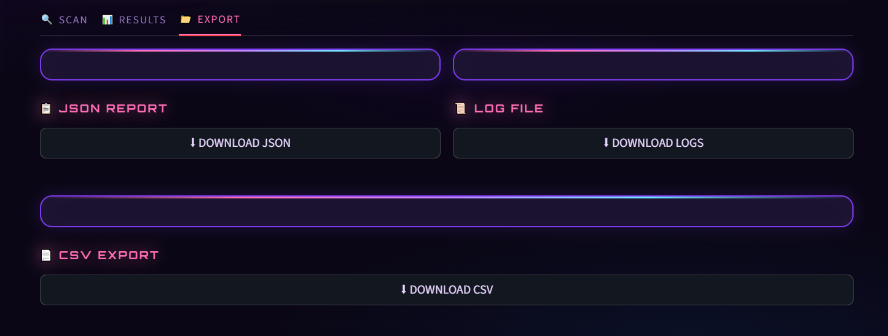
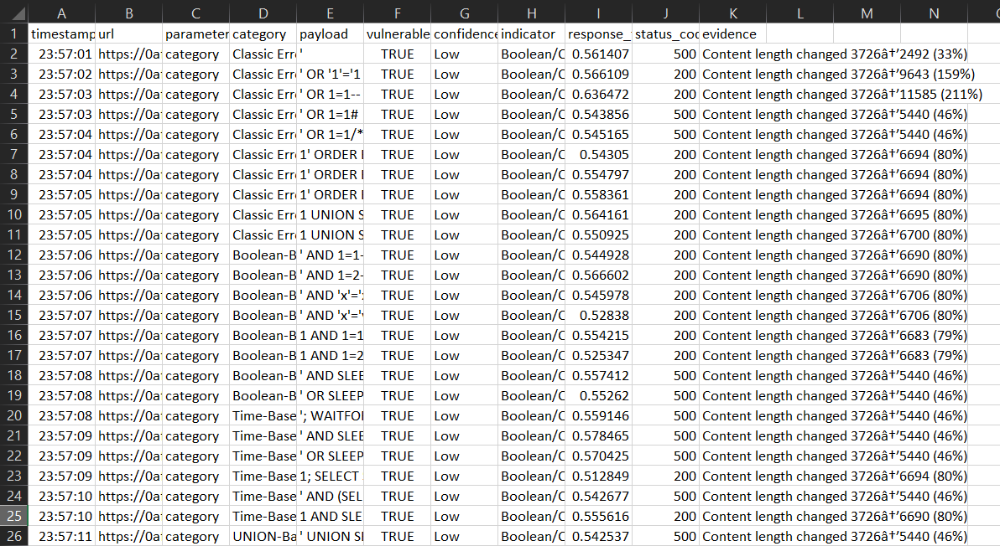

<div align="center">

```
███████╗ ██████╗ ██╗         ██╗    ██████╗ ██╗  ██╗ █████╗ ███╗   ██╗████████╗ ██████╗ ███╗   ███╗
██╔════╝██╔═══██╗██║         ██║    ██╔══██╗██║  ██║██╔══██╗████╗  ██║╚══██╔══╝██╔═══██╗████╗ ████║
███████╗██║   ██║██║         ██║    ██████╔╝███████║███████║██╔██╗ ██║   ██║   ██║   ██║██╔████╔██║
╚════██║██║▄▄ ██║██║         ██║    ██╔═══╝ ██╔══██║██╔══██║██║╚██╗██║   ██║   ██║   ██║██║╚██╔╝██║
███████║╚██████╔╝███████╗    ██║    ██║     ██║  ██║██║  ██║██║ ╚████║   ██║   ╚██████╔╝██║ ╚═╝ ██║
╚══════╝ ╚══▀▀═╝ ╚══════╝    ╚═╝    ╚═╝     ╚═╝  ╚═╝╚═╝  ╚═╝╚═╝  ╚═══╝   ╚═╝    ╚═════╝ ╚═╝     ╚═╝
```

**SQL Injection Scanner — Ethical Penetration Testing Tool**

<br>


</div>

---

<div align="center">

```
═══════════════════════════════════════════════
              OVERVIEW
═══════════════════════════════════════════════
```

</div>

## Overview

SQLi Phantom is a purpose-built SQL injection scanner featuring a cartoon-cyber aesthetic Streamlit GUI. It probes web application input fields using 60+ crafted payloads across seven attack categories, detects vulnerability indicators via error-based, boolean-blind, and time-based techniques, and streams live results with confidence scoring. Built for authorized penetration testing only — validated against PortSwigger Web Security Academy labs, DVWA, and WebGoat.

---

<div align="center">

```
═══════════════════════════════════════════════
              OBJECTIVES
═══════════════════════════════════════════════
```

</div>

## Objectives

- Automate detection of SQL injection vulnerabilities across GET and POST parameters
- Implement multi-threaded concurrent scanning with configurable rate limiting
- Provide real-time log streaming and confidence-scored findings in a visual dashboard
- Support export of scan results in JSON, CSV, and plain-text log formats
- Enforce ethical usage through session-scoped targeting and legal-use guardrails

---

<div align="center">

```
═══════════════════════════════════════════════
         TOOLS & TECHNOLOGIES
═══════════════════════════════════════════════
```

</div>

## Tools & Technologies

<div align="center">

| Layer | Technology |
|---|---|
| Language |  |
| GUI Framework |  |
| HTTP Client |  |
| Concurrency |  |
| Pattern Matching |  |
| Data Export |   |
| Styling |   |
| Test Targets |   |

</div>

---

<div align="center">

```
═══════════════════════════════════════════════
           PROJECT STRUCTURE
═══════════════════════════════════════════════
```

</div>

## Project Structure

```
SQLi-Phantom/
│
│── sqli_scanner.py          # Main application — scanner engine + Streamlit GUI
│── requirements.txt         # Python dependencies
│── README.md
│
└── Screenshots/
    │── config-panel.png
    │── target-scan.png
    │── scan-process.png
    │── results-section.png
    │── vulnerabilities-detected.png
    │── export-report.png
    └── csv-logs.png
```

---

<div align="center">

```
═══════════════════════════════════════════════
       METHODOLOGY & IMPLEMENTATION
═══════════════════════════════════════════════
```

</div>

## Methodology & Implementation

### 1. Payload Engine

Seven injection categories are defined as a structured dictionary — Classic Error-Based, Boolean-Based Blind, Time-Based Blind, UNION-Based, Stacked Queries, Out-of-Band, and Authentication Bypass — totalling over 60 crafted payloads. Each is injected as a suffix onto the target parameter value.

### 2. Detection Logic

Three independent detection methods run per probe response. Error-based detection matches against 18 database error signature patterns using compiled regex. Boolean-blind detection compares content length and keyword presence between the baseline and injected responses. Time-based detection thresholds response delay against the baseline to identify `SLEEP()` and `WAITFOR` induced latency.

### 3. Concurrency & Rate Limiting

Probes are dispatched through Python's `ThreadPoolExecutor` with a configurable worker count of 1–20. A thread-safe token-bucket `RateLimiter` class enforces a user-defined ceiling of requests per second, preventing server overload and evading basic rate-based defenses.

### 4. Live Streaming Architecture

Three `queue.Queue` instances pipe progress values, log entries, and vulnerability results from the background scan thread to the Streamlit main thread in real time. The UI polls these queues at 150 ms intervals, rendering the live log terminal and updating the progress bar without blocking.

### 5. Confidence Scoring

Each finding is assigned a confidence tier — **High** for confirmed SQL error strings, **Medium** for measurable time delays, and **Low** for statistically significant content changes — displayed as color-coded chips in the results dashboard.

---

<div align="center">

```
═══════════════════════════════════════════════
         RESULTS & SCREENSHOTS
═══════════════════════════════════════════════
```

</div>

## Results & Screenshots

<br>

### Configuration Panel



The sidebar configuration panel allows full control over target URL, HTTP method, parameter injection points, payload category selection, concurrency, rate limiting, and timeout — all styled with the cartoon-cyber theme using Orbitron, Rajdhani, and VT323 typefaces.

---

### Target Scan Setup



The scan tab renders a pre-flight summary of the configured target with injected parameters displayed as neon chips, alongside a runtime overview of concurrency and probe count before launch.

---

### Scan Process — Live Log



The live log terminal streams real-time output from the background scanner thread, colour-coded by severity — cyan for informational entries, amber for warnings, and red for confirmed vulnerability hits.

---

### Results Section



Findings are grouped by parameter and rendered as confidence-scored cards showing the payload, indicator type, HTTP status code, response time, and extracted evidence snippet from the server response body.

---

### Vulnerabilities Detected



High-confidence findings are highlighted in critical red cards with an automated `VULNERABLE` badge, displaying the exact injection string, detection method, and server-side evidence confirming exploitability.

---

### Export Report



The Export tab provides one-click downloads for a structured JSON report with full scan metadata, a flat CSV for spreadsheet analysis, and a plain-text log file for archiving or sharing.

---

### CSV Logs



Exported CSV output containing timestamped findings with columns for parameter, payload, confidence tier, indicator type, response time, HTTP status code, and evidence — ready for inclusion in a formal penetration testing report.

---

<div align="center">

```
═══════════════════════════════════════════════
          COMMANDS & SETUP
═══════════════════════════════════════════════
```

</div>

## Commands & Setup

**Install dependencies**
```bash
pip install -r requirements.txt
```

**Launch the application**
```bash
streamlit run sqli_scanner.py
```

**Run against PortSwigger Lab**
```
URL     →  https://<lab-id>.web-security-academy.net/filter
Params  →  {"category": "Gifts"}
Method  →  GET
```

**Run against DVWA (Docker)**
```bash
docker run --rm -p 80:80 vulnerables/web-dvwa
```
```
URL     →  http://localhost/dvwa/vulnerabilities/sqli/
Params  →  {"id": "1", "Submit": "Submit"}
Method  →  GET
```

**Example payloads triggering High confidence results**
```sql
' UNION SELECT NULL,NULL--
' AND SLEEP(3)--
' OR '1'='1'--
admin'--
```

---

<div align="center">

```
═══════════════════════════════════════════════
              CONCLUSION
═══════════════════════════════════════════════
```

</div>

## Conclusion

SQLi Phantom demonstrates a full-cycle implementation of a SQL injection scanner — from payload construction and multi-threaded dispatch through real-time result streaming and structured report generation. The project reinforced core penetration testing methodology, regex-based response analysis, Python concurrency patterns, and the importance of ethical scope definition. Validated across PortSwigger Web Security Academy labs and DVWA, the tool successfully identifies error-based, boolean-blind, and time-based injection vulnerabilities with confidence scoring. It serves as a practical foundation for further extension into cookie-based authentication handling, automatic form crawling, and second-order injection detection.

---

<div align="center">

```
═══════════════════════════════════════════════
             LEGAL NOTICE
═══════════════════════════════════════════════
```

</div>

## Legal Notice

This tool is developed strictly for authorized security testing and educational purposes. Only use against systems you own or have explicit written permission to test. Unauthorized scanning of any system is illegal and unethical. The author assumes no liability for misuse.

---

<div align="center">

Developed as part of a personal cybersecurity tooling project

<br>

*SQLi Phantom · Authorized Penetration Testing Only*

</div>
